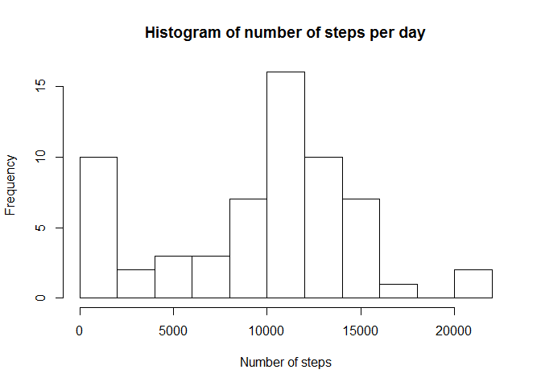
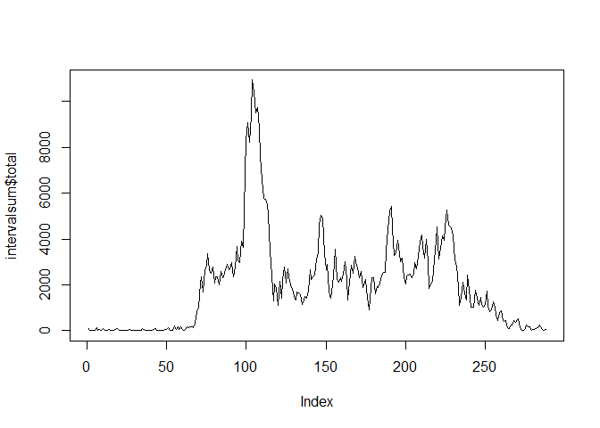
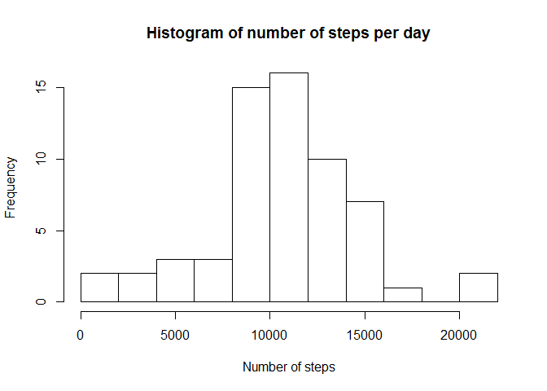
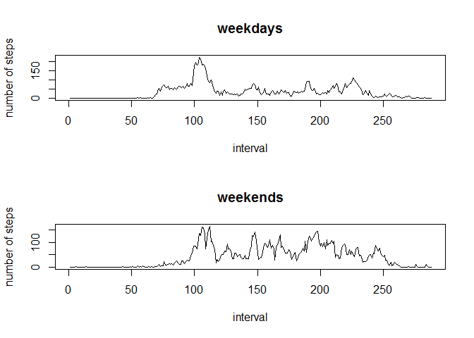

# Reproducible Research: Peer Assessment 1


## Loading and preprocessing the data


```r
zipfile = "activity.zip"
datafile = "activity.csv"

if( !file.exists(datafile) )
  unzip(zipfile)


rawdata <- read.csv(datafile)
rawdata$date <- as.POSIXlt(rawdata$date, format="%Y-%m-%d")
```

## What is mean total number of steps taken per day?


```r
library(plyr)
dailysum <- ddply(rawdata, .(date), summarize, total=sum(steps, na.rm=TRUE))
hist(dailysum$total, breaks=10,
  	main="Histogram of number of steps per day",
		xlab="Number of steps")
```

 

```r
meandailysteps <- mean(dailysum$total, na.rm=TRUE)
mediandailysteps <- median(dailysum$total, na.rm=TRUE)
```

The mean number of steps per day is 9354.2295082.
The median number of steps per day is 10395.


## What is the average daily activity pattern?


```r
intervalsum <- ddply(rawdata, .(interval), summarize, total=sum(steps, na.rm=TRUE))
plot(intervalsum$total, type="l")
```

 

```r
maxstepinterval <- intervalsum$interval[which.max(intervalsum$total)]
```

The interval that contains the maximum number of steps is number 835.

## Imputing missing values


```r
numempty <- sum(is.na(rawdata$steps))

numdays = 61
intervalsumrep <- rep.int(t(intervalsum$total/numdays), numdays)
imputeddata <- rawdata
imputeddata$steps[is.na(rawdata$steps)] <- 
  intervalsumrep[is.na(rawdata$steps)]

dailysumimputed <- ddply(imputeddata, .(date), summarize, total=sum(steps, na.rm=TRUE))
hist(dailysumimputed$total, breaks=10,
		main="Histogram of number of steps per day",
		xlab="Number of steps")
```

 

```r
meandailystepsimputed <- mean(dailysumimputed$total, na.rm=TRUE)
mediandailystepsimputed <- median(dailysumimputed$total, na.rm=TRUE)
```

The mean number of steps per day, including imputed values, is 1.0581014\times 10^{4}.
The median number of steps per day, including imputed values, is 1.0395\times 10^{4}.
The mean increases, but the median does not change.


## Are there differences in activity patterns between weekdays and weekends?


```r
imputeddata$daytype <- as.factor(imputeddata$date$wday>0 & imputeddata$date$wday<6)


weekdaymean <- ddply(imputeddata[imputeddata$daytype==TRUE,], .(interval),
  			summarize, total=mean(steps, na.rm=TRUE))
weekendmean <- ddply(imputeddata[imputeddata$daytype==FALSE,], .(interval),
				summarize, total=mean(steps, na.rm=TRUE))

par(mfrow=c(2,1))
plot(weekdaymean$total, type="l", main="weekdays",
			 xlab="interval", ylab="number of steps")
plot(weekendmean$total, type="l", main="weekends",
			 xlab="interval", ylab="number of steps")
```

 
